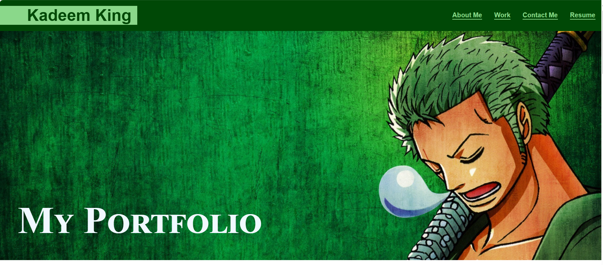

# Advanced CSS Challenge: Professional Portfolio

## Description

For this project we were tasked with creating a portfolio for ourselves. I used the skills I learned from my previous CSS lessons how to style my pageand make it mobile responsive. 

- I was able to design my page with background images and colors to add personality to my portfolio. 

- I created a nav bar with links that help navigate the user through the page. 

- I included a photo of my 1st project as well as a live link to the project. 

- I used Media Query to make my page mobile responsive.

## Table of Contents

- [Usage](#usage)
- [Credits](#credits)
- [License](#license)

## Usage

<a href="https://github.com/Kadeemking/Module-2-Challenge.git">Git Hub Repo</a>

<a href="https://kadeemking.github.io/Module-2-Challenge/">Live link</a>

## Credits

<a href="https://coding-boot-camp.github.io/full-stack/github/professional-readme-guide">README Format</a> 

<a href="https://gist.github.com/lukas-h/2a5d00690736b4c3a7ba">License for README</a>

## License

